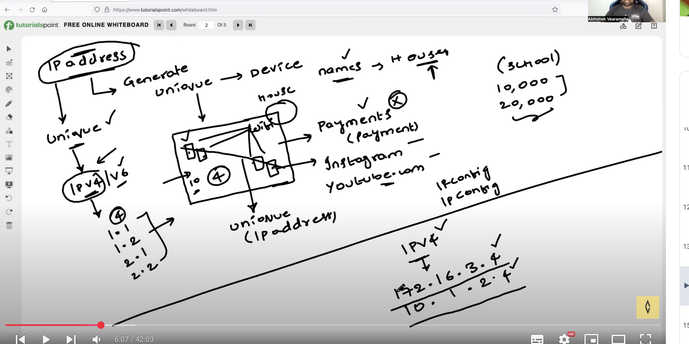
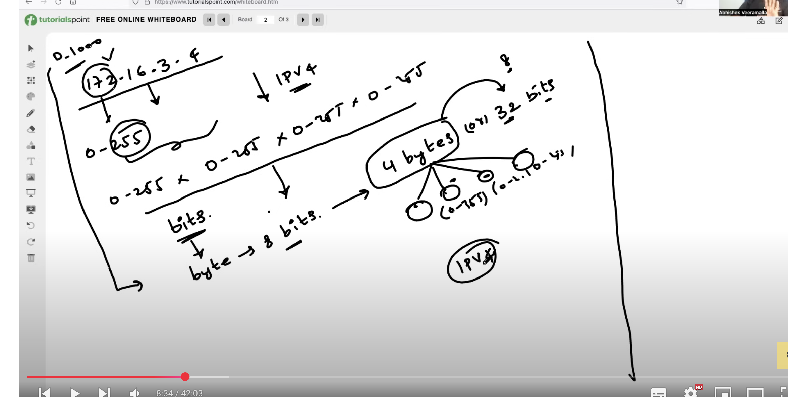
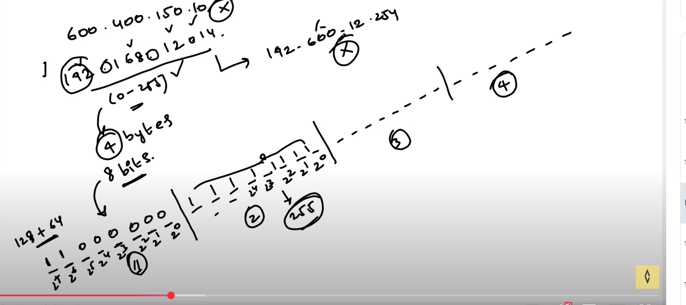
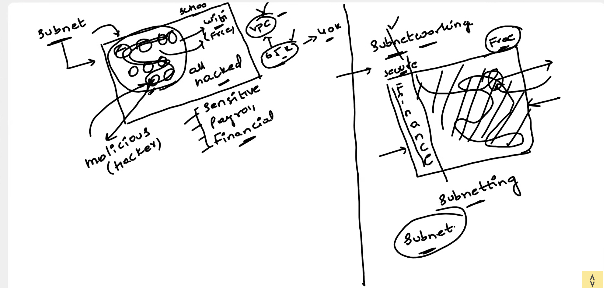
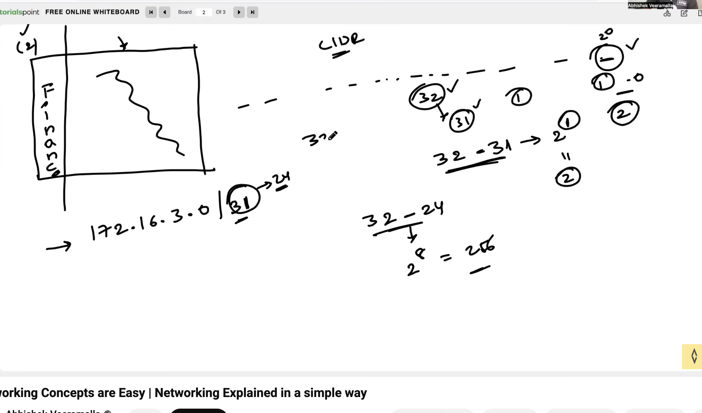
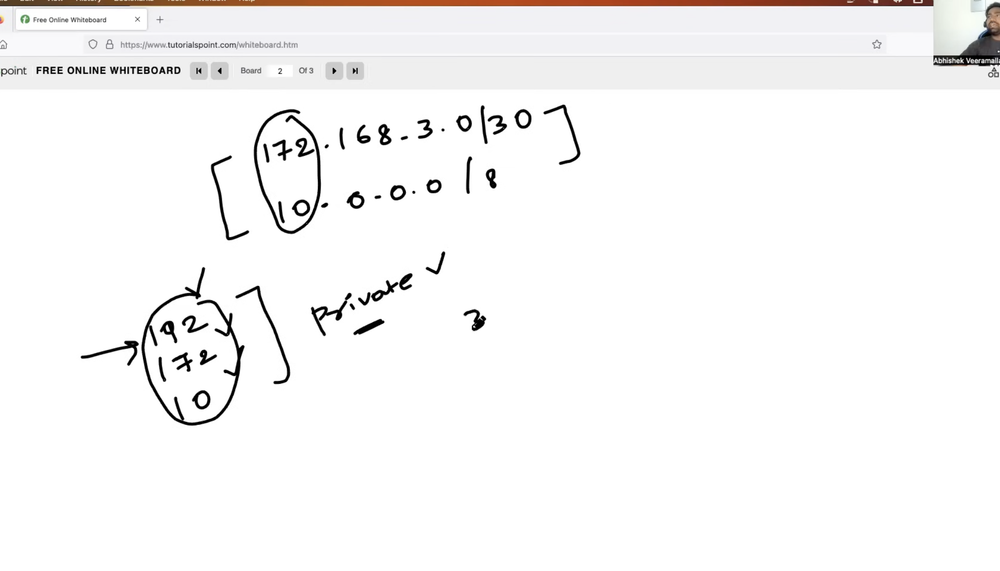

* Networking

IP address --? generate unqiue ID for a device
To generate unqiue address --> IPv4/V6

* Advantages of subnet:
security, privacy , isolation

* Types: 
private(No acccess to internet)
public(access to internet)

