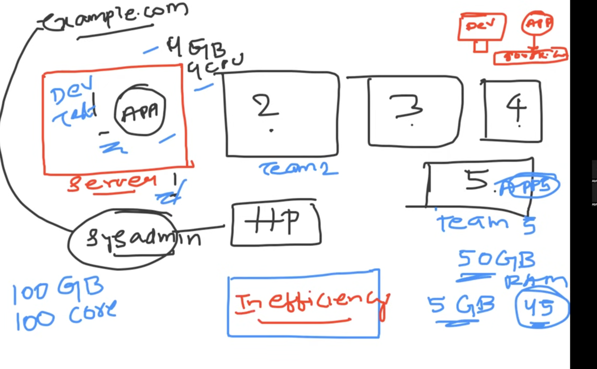
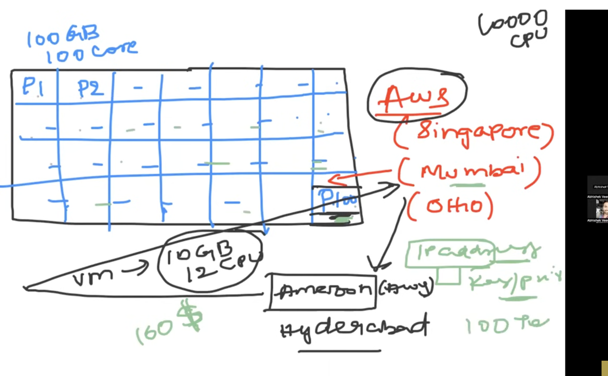

* what is a server??
A server is a powerful computer or system that provides resources, data, services, or programs to other computers (clients) over a network

* A hypervisor is a software that you can use to run multiple virtual machines on a single physical machine

