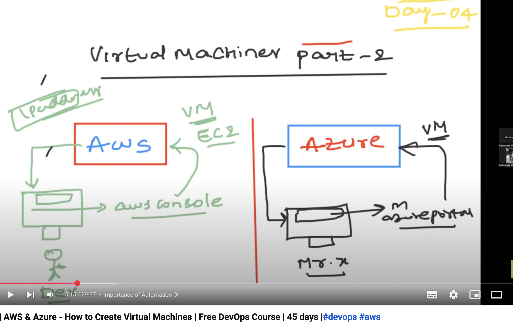
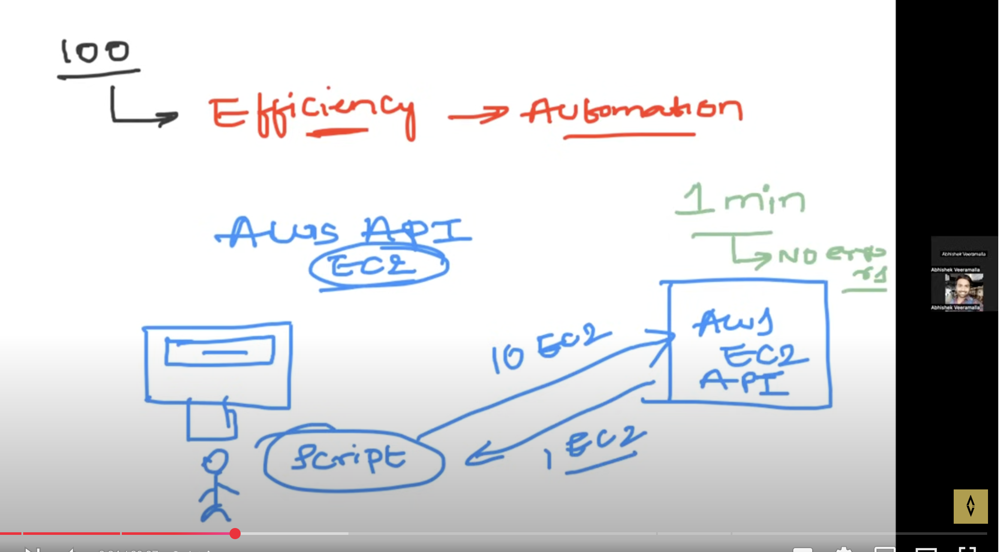
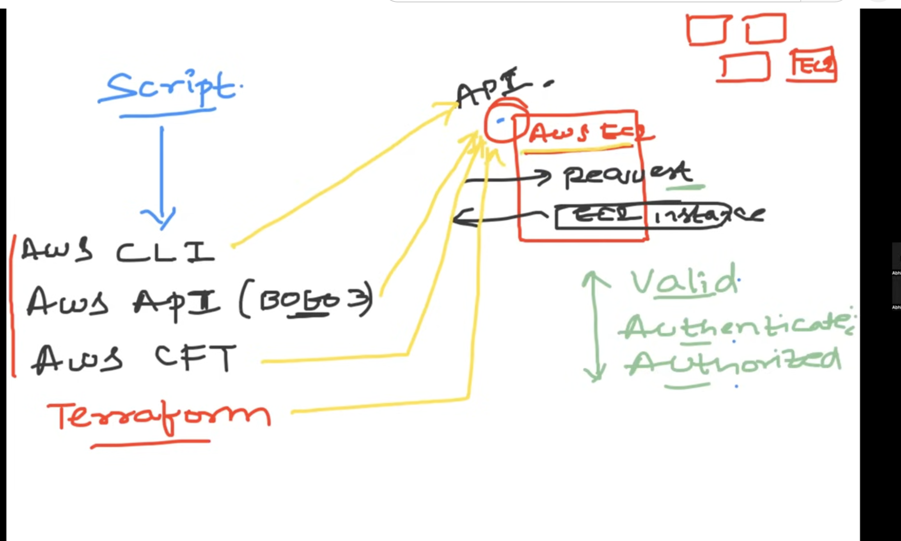

# Virtual machines part 2

Amazon - AWS
Microsoft - Azure

* To create a new virtual machine login to AWS Console
* Making a request to AWS requesting new virtual machine(EC2 instance in AWS Terminology)
* AWS inresponse will send u IP adress and specifications required

* Instead of manually going to aws console and requesting the new virtual machine, Devops engineer can write a script for making call to AWS EC2 api(mentioning 10EC2 instances)

* Amazon provides 100s of services.EC2 service developers will expose EC2 API.This APi will receive request and if its valid, authenticated and authorized inresponse EC2 INSTANCE  is sent

* Devops engineer will write a script making call to this api exposed

* Script  --> 
Aws CLI
Aws API(rest api)
AWS CDK
AWS supports CFT (cloud flatform template)

