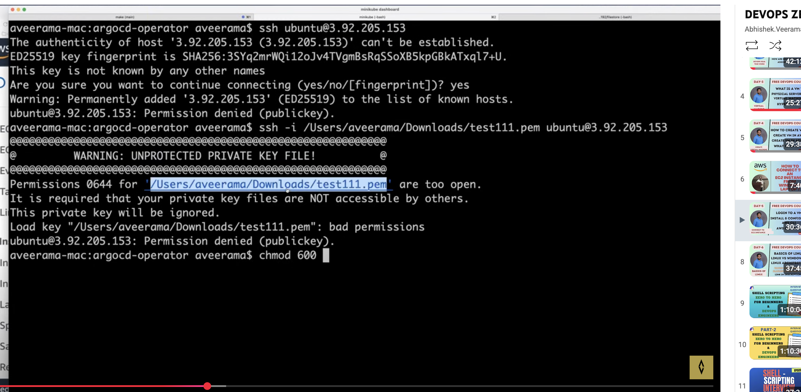
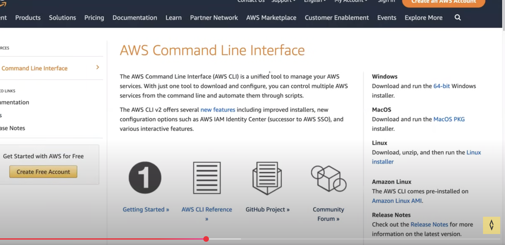

# AWS CLI

touch likhitha
ls likhitha
ssh -i /Users/sailikhitha/Downloads/test204.pem ubuntu@13.61.176.33

chmod 600 path --> to hide pem

Install aws Cli - https://docs.aws.amazon.com/cli/latest/userguide/getting-started-install.html

secret credentails --> create accesskey and secret key

go to command line give aws configure

Give the keys and aws s3 ls
use mb to create a bucket