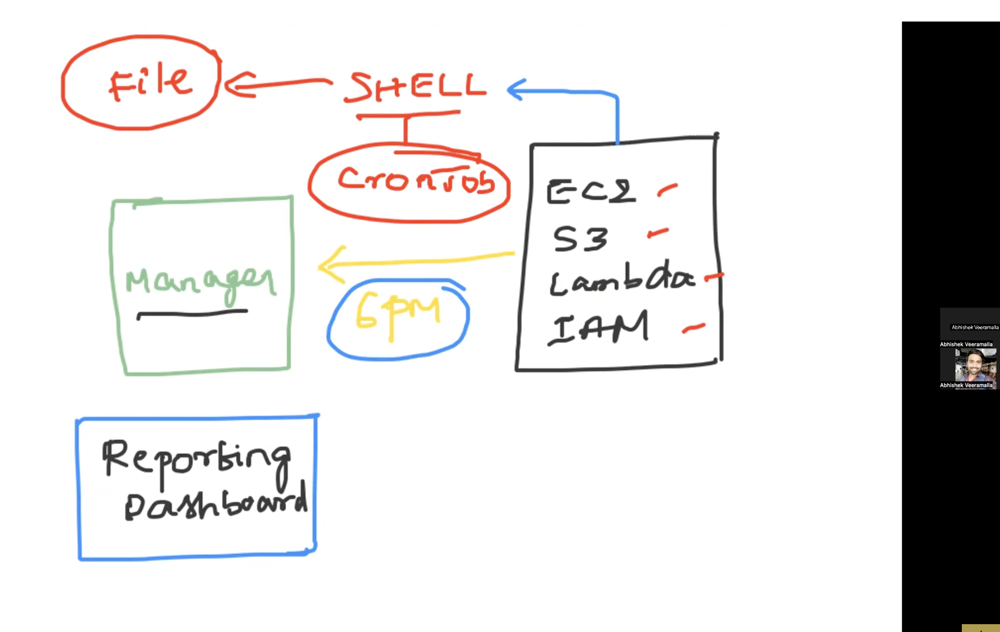

* Write a  script to report the usage of AWS In your project ?

Moving to cloud main reasons:
1.Management   2.Cost

Tracking the resource usage is important for cost effectiveness

Cronjob --> one of linux process will wait for the time mentioned and execute the shell script

It can be done with AWS CLI

#!/bin/bash

########
# Author: Likhitha
# Date: 27th July 2025

# This script will report the AWS resource usage
########

set -x

# AWS S3
# AWS EC2
# AWS Lambda
# AWS IAM Users

# list s3 buckets
echo "Print list of s3 buckets"
aws s3 ls

# list EC2 instances
echo "Print list of ec2 buckets"
aws ec2  describe-instances

# list AWS lambda
echo "Print list of lambda buckets"
aws lambda list-functions

# list IAM USers
echo "Print list of iam users"

* we want Ids instead of all the info

aws ec2 describe-instances | jq  '.Reservations[].Instances[].InstanceId'

jq - json parser
yq - yaml parser