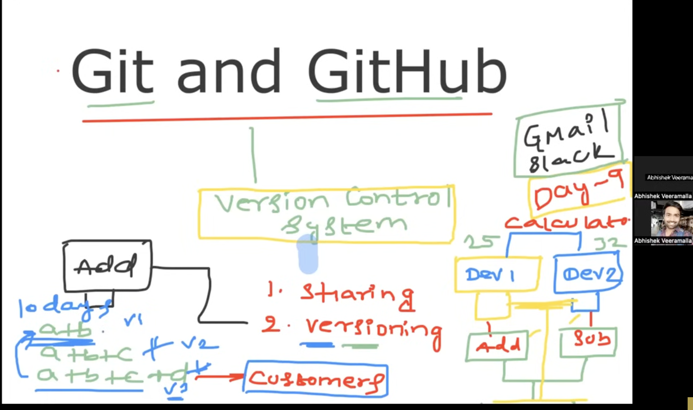
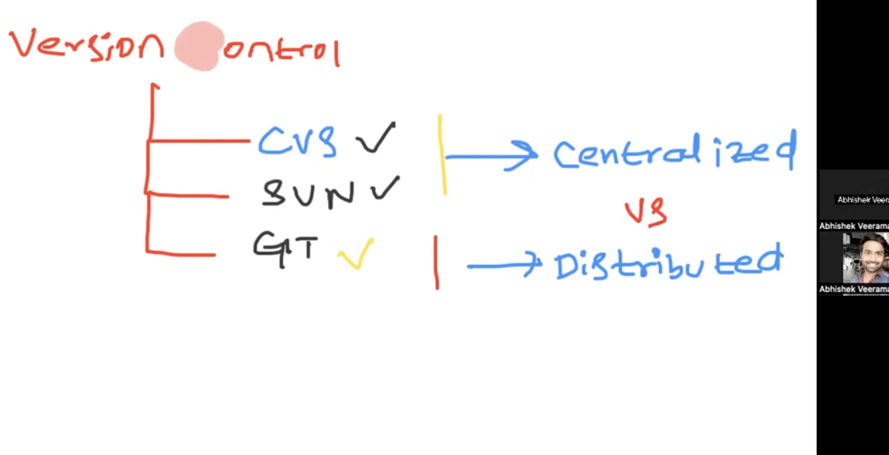
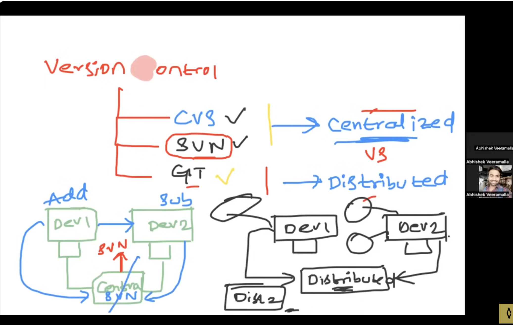

* Git and Github

version control systems:
* CVS
* SVN
* GIT

Fork: Creating an existing copy of repository

* when SVN/CVS is used and when its down Developers have no way to communicate.This is the problem with centralized 

GIT Vs GITHUB
git --> open source --> download  --> we can create a ec2 instance, install git, every developer should commit the changes to git server

GITHUB --> usability, commenting, reviewing,issues,project management

* Install git using commands specific to OS
* git init --> Initialize a git repository

* Life cycle of git
- git add
- git commit
- git push

* git diff --> changes made difference
* git reset --hard commitid --> to go to that commit

*
