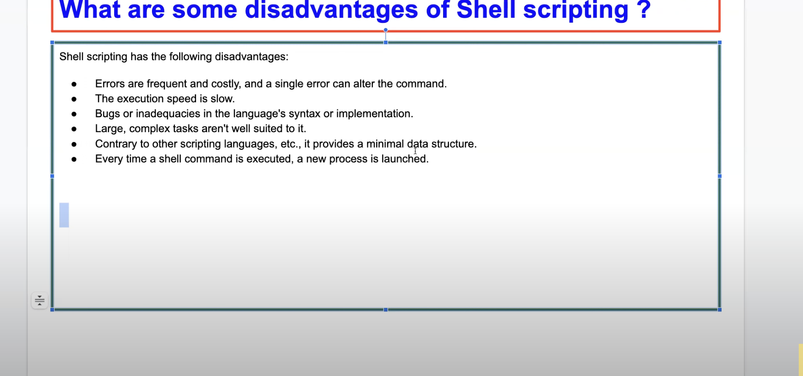

* List some of the commonly used shell commands ?
  ls,touch,grep,mkdir,mv
* Write a simple shell script to list all processes 
  ps -ef | awk -F" " '{print $2}
* Write a script to print only errors from a remote log?
curl google.com | grep TRACE 
* Write a shell script to print numbers divided by 3 & 5 and not 15?
create a file --> vim newfile.sh

#!/bin/bash

divisible by 3,5 not 15

for i in {1..100}; do
if([ `expr $i % 3` == 0] ||  [`expr $i % 5` == 0]) &&  [`expr $i % 15` != 0];
then
     echo $i
fi;
done

chmod 777 newfile.sh

./newfile.sh

* Write a script to print number of "S" in Mississippi??

!/bin/bash

x=mississipi

grep -o "s" <<< "${x}" | wc -l

o --> only 
<<< sending x into this command

* How will you debug the shell script?

set -x --> run in debug mode

* What is crontab in Linux? Can you provide an example of usage?
Linux Crontab is a powerful utility used for Task Scheduling and Task Automation in Unix-like operating systems. It facilitates the users to run the Linux Commands or scripts at specified time and intervals. It is ideal for recurring tasks such as system maintenance, backup, and updating.

* How to open a read-only file?
vim -r test.txt
 
* What is a difference between soft and hard link?

Using hardlink we can copy or mirror a file if original file is deleted copy will exist

Softlinks are not like that both files will be deleted

* What is a difference between break and continue statements ?

break --> breaking the execution
continue --> Skip this and continue the next
 
* What are some disadvantages of Shell scripting?

* What a different types of loops and when to use?
for,while, do while etc
* Is bash dynamic or statically typed and why?
python shell --> dynamically typed
 x= 5, y = "string"

 golang --> Var x string --> will throw error 

* Explain about a network troubleshooting utility?

