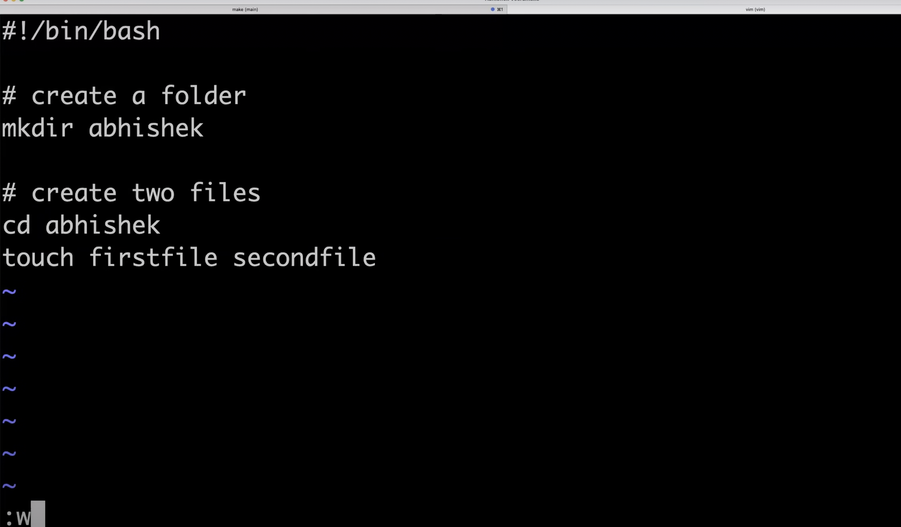
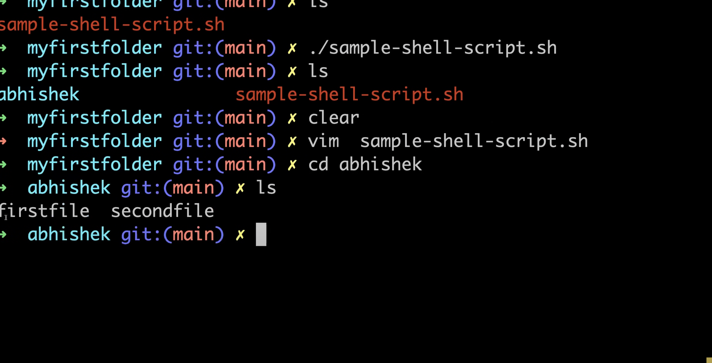
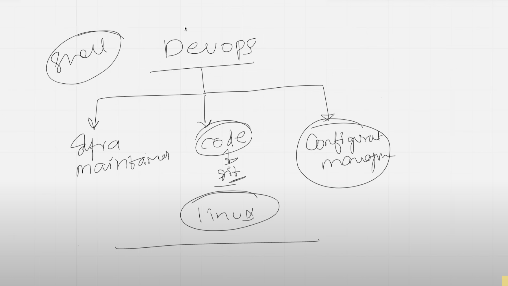
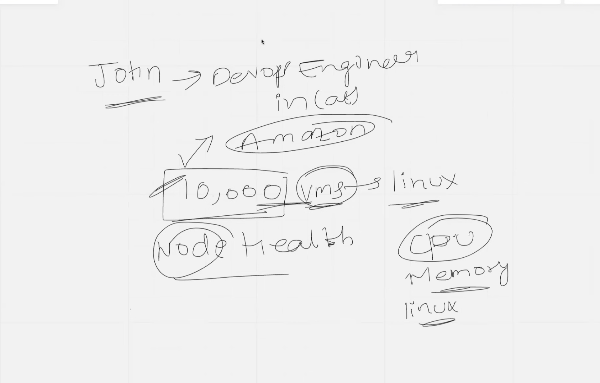
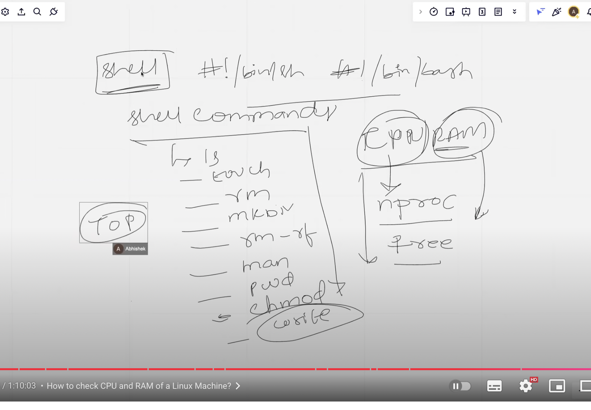

# Shell scripting
* It is a process of automating day to day activities in LINUX

* How??
* To create a file  --> use touch filename with extension .sh
* TO list the files --> ls 
* with time and details --> ls -ltr
* Details of any command --> man command
* Open the file --> vi filename/vim filename
* vim newfile  will create a file and open it 
* To write inside a file --> using shebang notation
 #!/bin/bash

 echo --> to print something 
 echo "my name is liksi"
press EScape and click on I to insert /write something

TO save the file press Escape -->colon --> wq! then press enter
Instead of wq if we use q content wont be saved and file willbe closed
* To see the content of the file  --> cat filename
* Exxecute the file --> sh filename or ./filename but got permission denied
* chmod --> grant permissions chmod filename
ch --> change  
chmod -- 3 types
1) what are permissons for root user 
2) which grp has
3) what are u r permissions 

* TO grand access to all users chmod 777 filename
4 -> read 
2 --> write
1--> execute

* history --> different commands we used will be displayed
* present working directory - pwd
* Create a folder --> mkdir foldername
* Go to created folder --> cd foldername
* How to write  a shellscript?

* #-> command

* grand complete access to all users chmod 777

