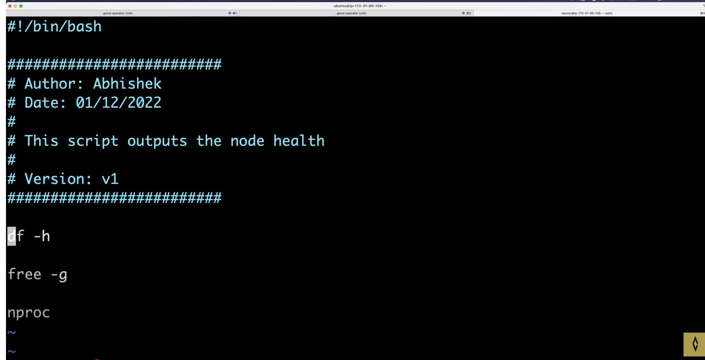
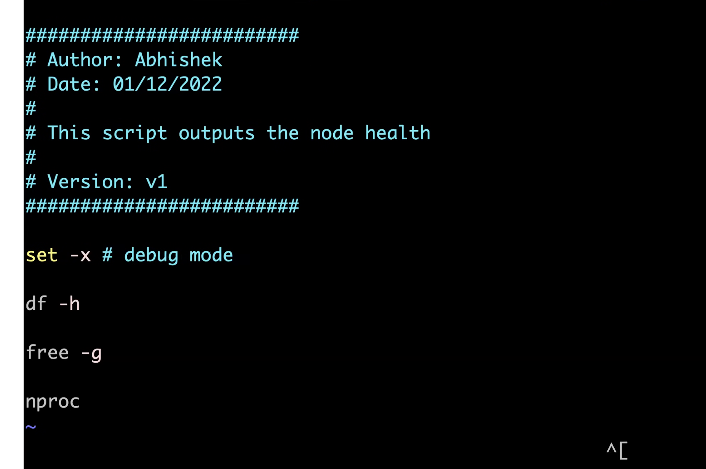
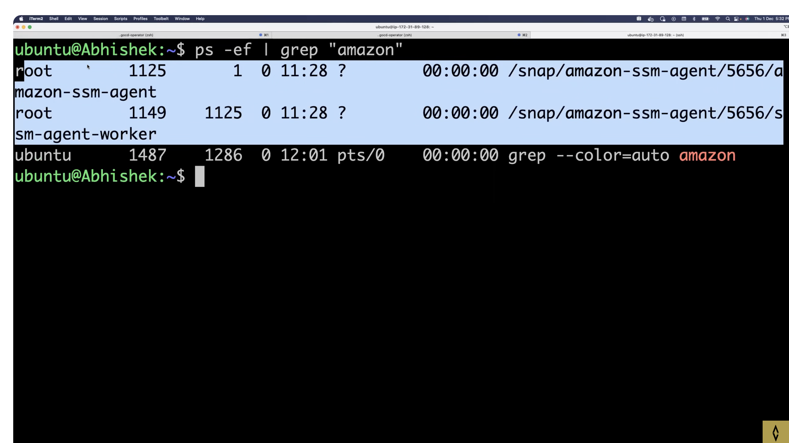
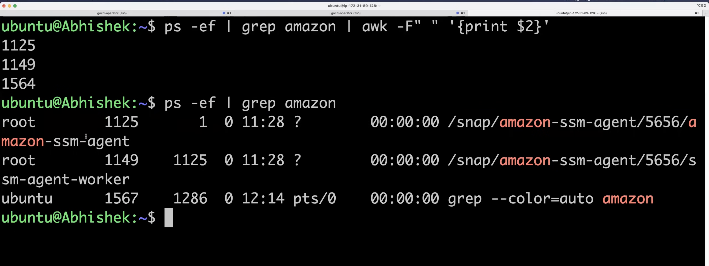
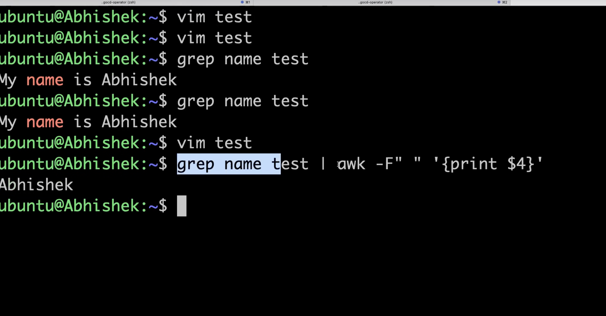
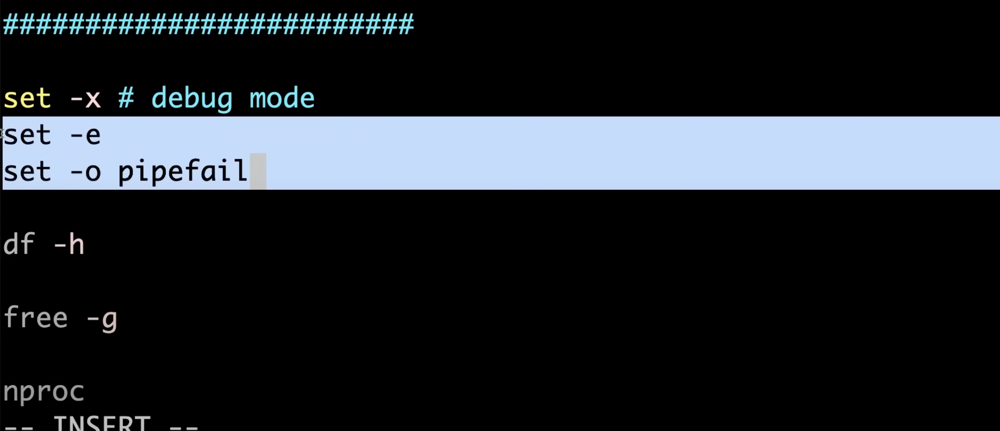
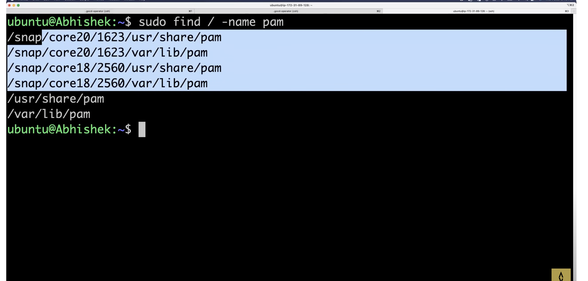
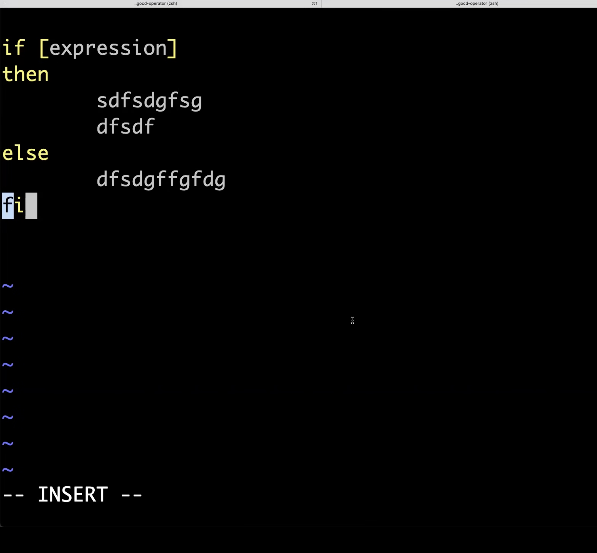
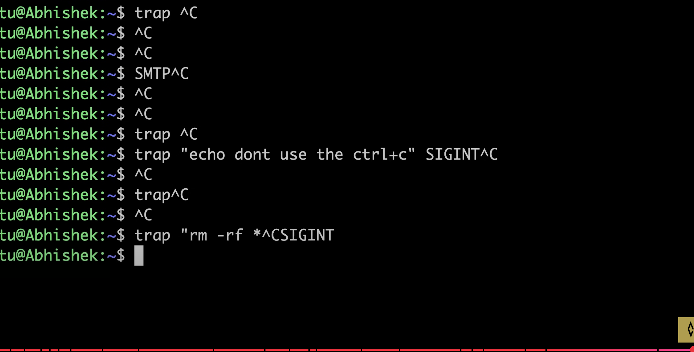

df -h --> print the disk space

below both not available on MAC

free -g --> print the memory

nproc --> print the cpu

set -x  -->  # debug mode

ps -ef --> process details in fullformat

ps -ef | grep "amazon" --> processes running amazon

* Pipe parameter: Sends the output of first command to the second command

* output of date | echo "this"???

* date value is sent to stdin but pipe command only gets the output and sends to second when it gets  output from stdout

* I want process Ids only instead of entire process
 --> awk  : to get any specific col.It can filter out info

ps -ef | grep amazon | awk -F" " '{print $2}'

* set -e --> exit the script when there is an error
* set -o  --> pipefail

* curl path | grep ERROR --> get output 

* curl -X GET url

* wget will download the file and use grep on downloaded file

* curl will get info directly 

*  sudo su - ---> will take to root user
sudo --> substitute user do
su --> switch user

* find -->  it will get the location of file 

# If else : 

